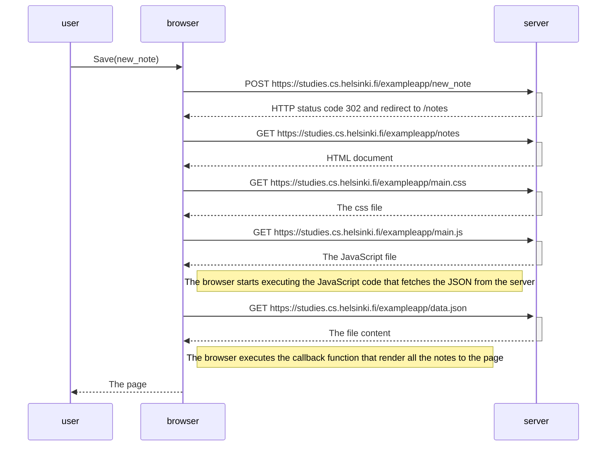
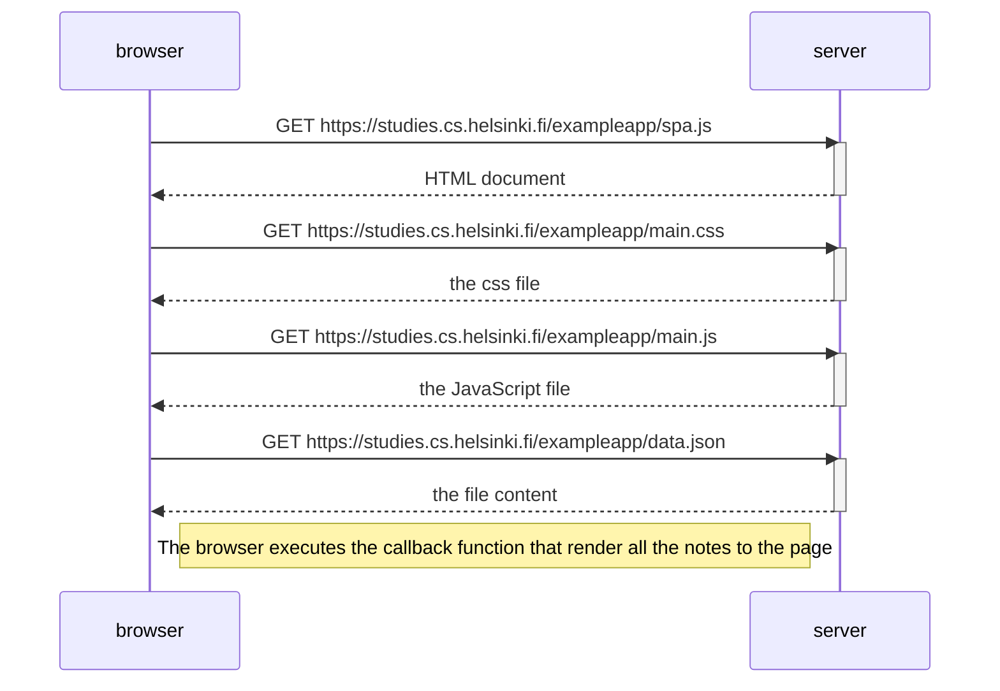
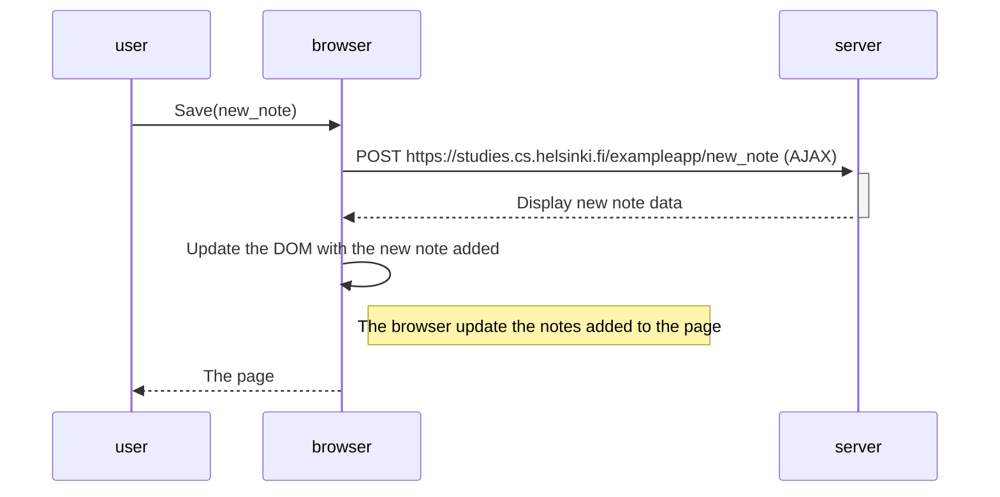

# Sequence_Diagrams_Part_0

  <b>Part 0.4</b> The diagram is to fetch the input text from the user and display it onto the same page (Traditional Web application) by reloading it.

 
  <b>Part 0.5</b> The diagram is to Load the page with single page application (SPA).

 
  <b>Part 0.6</b> The diagram is to fetch the input text from the user and display it onto the same single page application (SPA)

